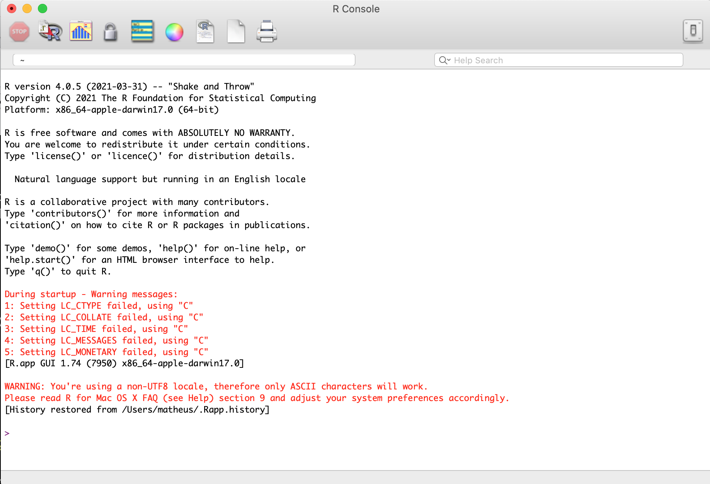
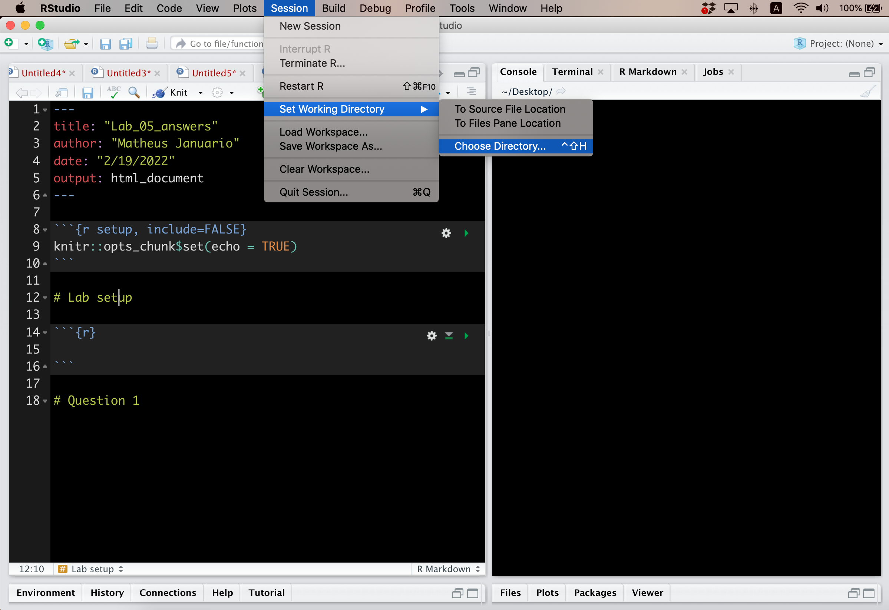
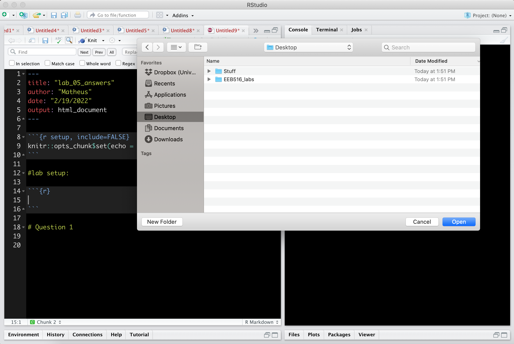
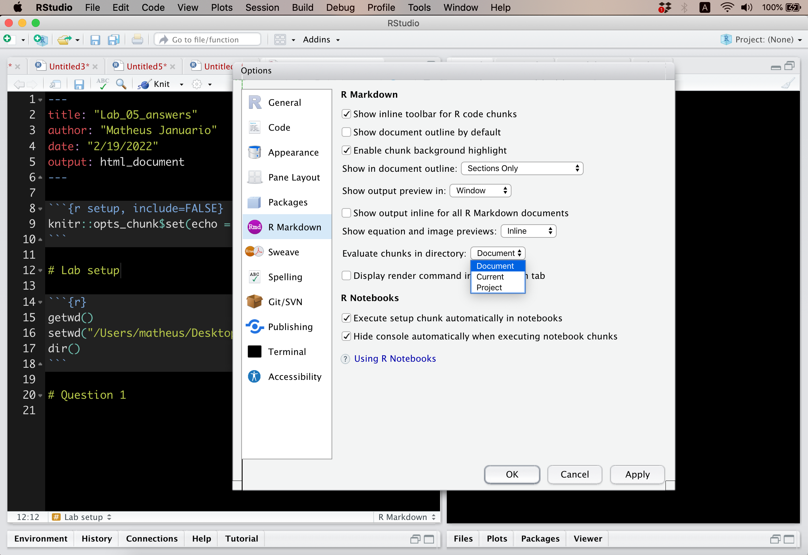

Instructions on EvolVEd, R, RStudio, RMarkdown
================
Matheus Januario, Jenniefer Auler, Andressa Viol, and Daniel Rabosky
Nov/2024

- [EvolVEd](#evolved)
  - [Installing EvolVEd](#installing-evolved)
  - [Vignettes (Tutorials)](#vignettes-tutorials)
<<<<<<< HEAD
  - [Community guidelines and suggesting
    changes](#community-guidelines-and-suggesting-changes)
- [If you never used R before…](#if-you-never-used-r-before)
  - [What is R and how can I install
    it?](#what-is-r-and-how-can-i-install-it)
  - [What is RStudio and how can I install
    it?](#what-is-rstudio-and-how-can-i-install-it)
  - [Starting R and RStudio:](#starting-r-and-rstudio)
  - [Working Routine in R](#working-routine-in-r)
- [What is RMarkdown and how can I install it
  (optional)?](#what-is-rmarkdown-and-how-can-i-install-it-optional)
=======
>>>>>>> pkgdown

# EvolVEd

`evolved` (EVOLutionary Virtual EDucation) is an open-source R package
designed for graduate or advanced undergraduate courses in evolutionary
biology. It emphasizes tools for inquiry-based learning, where students
engage in scientific practices to actively build knowledge (Pedaste et
al., 2015). The package includes `vignettes` (tutorials) to facilitate
classroom investigations. However, educators are encouraged to develop
their own content modules depending on class context and/or learning
objectives. Most of evolved‘s core functions are oriented towards either
($i$) developing student intuition for classic models in evolutionary
biology using simulations, or ($ii$) analyzing (parameter estimation,
hypothesis testing, visualization) datasets associated with key
questions in evolutionary biology.

## Installing EvolVEd

The EvolVEd package is available in two versions:

### Stable Version:

The stable version represents the “error-proof” version of the package.
It may have reduced features due to CRAN’s constraints (e.g., dataset
size). The stable version can be downloaded directly from the [The
Comprehensive R Archive
Network](https://cran.r-project.org/web/packages/evolved/index.html). A
simpler way to install this version is to run the following command in
your R terminal:

    install.packages("evolved")

### Development Version:

The development version is the most complete and updated version of the
package. It may contain datasets, functions, or documentation slightly
out of CRAN’s standards. The development version is hosted on
[GitHub](https://github.com/mjanuario/evolved) and requires the
`devtools` package for installation. If `devtools` is not already
installed, you can install it first by running the code lines below:

    # Install devtools 
    install.packages("devtools")

    # Then, install the development version of EvolVEd:
    devtools::install_github("mjanuario/evolved")

#### Features in the development version that are absent in the stable version:

- Datasets:
  - `mammals_spp` (Extant species list of mammals)
  - `ammonoidea_fossil` (Fossil occurrences of ammonoids
  - `mammals_fossil` (Fossil occurrences of mammals)
  - `trilob_fossil` (Fossil occurrences of trilobites)

## Vignettes (Tutorials)

To view the vignettes, run the following code:

    vignette("vignette_name", package = "evolved")

With `"vignette_name"` being one of the names below. Each vignette
covers the following topics, organized from basic to advanced:

#### 1. If you never used R before… (name: `install_r`)

- Introduces R and guides complete beginners through installation.
- Explains RStudio’s interface and recommended configurations.
- Teaches essential workflow: directories, saving, knitting, sourcing,
  loading data.
- Troubleshoots common R/RMarkdown issues for new users.
- Presents RMarkdown basics and why it’s useful for scientific work.

#### 2. Intro to R (name: `intro_r`)

- Basic R syntax and coding (objects, vector calculations, etc.)
- Plotting and annotation functions
- Overview of key object classes used in the vignettes

#### 3. Introduction to Population Genetics (name: `popgen_intro`)

- Simple mathematical notation
- Probability of independent events and random number generation
- Malthusian growth and Mendelian genetics
- Hardy-Weinberg Equilibrium (HWE) at a single locus
- Heterozygosity, deleterious alleles, and mutation
- Genetics at multiple loci and DNA variation

#### 4. Genetic Drift (name: `popgen_drift`)

- Intuition and qualitative expectations of genetic drift
- Variability in outcomes and heterozygosity decay
- Effective population size and historical context

#### 5. Selection in Population Genetics (name: `popgen_selection`)

- Breeding effective population size
- Mutation-drift equilibrium and selection
- Case studies (e.g., the peppered moths)

#### 6. Deep-Time Molecular Clocks (name: `deeptime_clocks`)

- Sequence data and genetic distance
- Poisson correction and Jukes-Cantor models
- Molecular clocks and their uncertainty
- Inferences about deep time

#### 7. Fossils and Deep-Time Patterns (name: `deeptime_rocks`)

- Exploring fossil occurrences and diversity patterns
- Spatial distribution and conclusions from fossil records
- Dating fossils in absolute time (technical notes)

#### 8. Birth-Death Models in Deep Time (name: `birthdeath_deeptime`)

- Deterministic expectations and stochastic processes
- Effects of variation on diversification rates
- Age-richness models and extinction dynamics

#### 9. Phylogenies and Birth-Death Models (name: `birthdeath_phylogenies`)

- Estimating diversification rates under pure birth and birth-death
  models
- Factors influencing speciation and extinction
<<<<<<< HEAD

## Community guidelines and suggesting changes

Questions and support requests should be sent to Matheus Januario’s
email (januarioml.eco \[at\] gmail.com). Bug & issue reports,
suggestions, improvements, or code additions should be pushed through
the same GitHub repository. Emailing Matheus Januario is also ok.

# If you never used R before…

If you’re new to R, this “pre-vignette” tutorial serves as an
introduction to using `evolved`. It was largely inspired by the first
tutorials in EEB 485 and EEB 391/516 (Population and Community Ecology &
Evolutionary processes and Macroevolution), but it is extended and
modified to work in our context. This document is meant to serve as a
first contact with the tools that will be of major importance in our
vignettes with `evovled`. Nothing related to this tutorial is required
to use the R package, but we will be using all the tools explained here,
so please make sure you have completed it before then (or to be genrlly
familiar with R).

This tutorial will be somewhat long, and if this is your first time
using R, it will also be a bit confusing. This is because a reasonable
part of what you will see here is pretty abstract. We ask you to trust
the learning process and keep reading until the end. We highly encourage
you to reach out to other peers more knowledgeable in R, if needed. We
know that different folks come with very different levels of comfort
with R – which means you will learn a lot with your colleagues, however
comfortable you may currently be with R.

## What is R and how can I install it?

R is (1) an open source software, (2) a programming language, and (3) a
programming environment. The first one means it is a computer program
you can freely download, use, or modify to your own needs. The second
means it is a language that allows humans and machines to communicate.
The third means it gives you everything you need to create your own
programs under a specific language. Scientists, especially in the
biological sciences, widely use R to run simulations and analyze their
datasets, so we will do this too.

If you’re using your own computer and have not yet installed R, you can
download and install it for free by pasting this in your web browser:

<http://cran.us.r-project.org/>

After you download it, install it as you would do with any other program
– the installer program will direct you though the major steps. When you
open R, you should see something close to Figure 1.

Please download and install R before progressing to install RStudio.

<div class="figure" style="text-align: center">


<p class="caption">
Example of recently-opened R on an Apple computer. The interface looks
slightly different on a Windows computer, but the main features are the
same. Note that depending on the details, you may or may not see the
same warnings and errors as the screenshot.
</p>

</div>

## What is RStudio and how can I install it?

RStudio is a development environment for R. As a very coarse
simplification, you can think of RStudio as a complement to R that makes
some tasks easier – a “shell” enveloping R that makes some
communications between you and R easier. However, many would say that
RStudio is not much of a helpful resource at all. If you never worked
with R before, you are encouraged to try both RStudio and just “plain” R
separately and make your own conclusion as to which makes you more
comfortable. You are not required to use RStudio to use `evolved`, but
you can use it if you think it will help your learning process (you are
required to use R, though).

Here in this class we will use programming as a learning tool, but
programming is also a skill that will develop your quantitative ability
and will make you a better scientist. If you really want to train this
skill and get really good at it, we highly recommend that at some point
of your career, you get used to programming just with R – and you are
invited to use this class as one opportunity to do that. However, if
your intention is to use R only occasionally, it might be worth jumping
straight to RStudio, at the cost of being limited by a series of details
and constraints that RStudio has.

If you need RStudio for your personal machine, you can download and
install it for free by pasting this in your web browser:

<http://rstudio.org>

After you download it, install as you would do with any other program –
the installer program will direct you though the major steps.

If you intend to use RStudio, please download and install it before
progressing to install RMarkdown. We will cover RMarkdown later in this
tutorial.

## Starting R and RStudio:

When you start R, you should see something like figure 1. If you start
RStudio instead, it will open R inside of the RStudio environment, and
should look like figure 2.

<div class="figure" style="text-align: center">


<p class="caption">
Example of recently-opened Rstudio. Note that the appearance of RStudio
is customizable, so your interface might not look the same as the
RStudio your instructors or your fellow students have
</p>

</div>

Just looking at figures 1 and 2, it is easy to see that RStudio gives a
lot more information. We will briefly walk through the items shown in
figure 2 to familiarize you with each quadrant in the RStudio
environment. Note that in both figures we are not showing the upper part
of the screen (containing the tabs “File”, “Edit”, “Code”, “View”,
etc.), but sometimes you will use those options too.

- Upper-left: The script. This is where you view, edit, and save text
  files, including R scripts (.R files) and RMarkdown (.Rmd) files. You
  will use this quadrant the most during your learning activities.

- Lower-left: the console (a.k.a terminal, a.k.a. command line). This is
  where lines of script get processed and computed. Here, you can see
  what code was actually input and run, and what the computer’s output
  was. You can also paste and execute commands directly into the
  console, instead of through the script file. This space will also be
  used exhaustively.

- Upper-right: Four tabs:

  - Environment: for loading/saving/examining data (you may or may not
    use this one much, will depend on your habits)
  - History: a list of commands you’ve typed (again, use here will
    depend on your habits)
  - Connections: for linking to specific database types (we will
    basically not use this during vignettes)
  - Tutorial: a useful resource with tutorial demonstrations of R code
    and functions (not used at all in `evolved`)

- Lower-right: Five tabs:

  - Files: a list of files in the “working directory” (more on this
    later in this tutorial)
  - Plots: where the plots/figures you create will appear (we will use
    this extensively in vignettes)
  - Packages: an area for managing installed R packages (probably you
    will not use it much during vignettes)
  - Help: access to official documentation for R (we will use this
    extensively)
  - Viewer: for viewing web content (probably not used frequently in
    vignettes)

If you want to use RStudio, there are a series of configurations that we
highly recommend you have. You can access them by going to the upper
part of the screen (the one that contains the tabs “File”, “Edit”,
“Code”, “View”, etc), clicking *Tools \> Global Options*, and then
editing options. Opinions on the best configuration vary, but below you
have the link to a blog post that shows a possible configuration that
might be helpful during our classes: (link:
<https://www.r-bloggers.com/2019/05/my-rstudio-configuration/>)

Use your time to get used to all this new software.

## Working Routine in R

In this short tutorial we will help you to navigate through your files.
You can think of this as a checklist to use at the start of any of the
labs in this class. Steps 1-4 have to be done before any lab. Steps 5
and 6 will be needed depending on the lab.

We start by revising what the “Desktop” of your computer is – the
standard folder most computer operating systems (i.e., Windows, MacOS,
Linux…) have. It is the first “place” your computer puts you in when you
turn it on, seen in the screen shot below, which is my Desktop:


  

If you are not comfortable with coding or R, we suggest you create a
folder for storing all our classwork in the “Desktop” of your computer,
like we did in the screen shot above. If you are comfortable with
programming, work as you wish.

### Step 1: Setting work directory

The working directory is the folder in your computer that R will
navigate to during a session. Any time you import files or write files
to a folder, R will automatically use the folder that is set as the
working directory. To set the working directory, open R and click, in
the upper bar, on *Session \> Set Working Directory \> Choose Directory*
as in the figure below (notice that my .Rmd file is on the left panel
and my R console, different from the RStudio default, is on the right –
notice also that I minimized all other panels in my RStudio):



  

After clicking on *Choose Directory*, you should see something like the
screenshot below:



Once there, you can navigate to the folder where you are storing files
for this class, or a subfolder of that folder, to set it as your working
directory. It’s important to keep your working folders for each lab
organized, as they will include several different files types, including
both R scripts (`.R` files) and data files (e.g., `.txt`, `.csv`, etc.).
For instance if you had downloaded the files
`cyt-oxidase1-mt-aligned.txt` and `R_functions.R` and added them to your
working directory folder, it would look like this:


After following the above steps, you will have set the directory in
which you will be working for the current R “session”. This is the
folder R will use as a reference, from now until you close R or change
the directory.

### Step 2: Checking working directory

**(I)** To check what working directory you are in, type `getwd()` into
the console or into a script file. This function will tell you which
folder is currently set as the working directory by giving you a path
name to the folder. If you decided to store your folder in the Desktop,
you should see something in the following format (note this follows
Mac/Linux formatting, Windows will write this slightly differently):

`".../[username]/Desktop/[name_of_your_folder]"`

The things we put inside brackets in the line above are things we expect
to be different in your case, given your operational system and the
names of your folders.

In my computer (in a Mac/Linux system), I get:

    getwd()
    [1] "/Users/matheus/Desktop/EEB516_labs/lab_05"

R can also return a “compacted” version of the exact same line, which
would be:

    getwd()
    [1] "~/Desktop/EEB516_labs/lab_05"

This contraction in particular occurs in Linux and MacOS systems.
Windows may show a similar contraction, but it can vary from version to
version, and you are welcome to reach out to your GSI in case there are
any problems. This contraction is a resource that helps more advanced
programmers (at the cost of being slightly confusing for newcomers).

What I recommend you to do is: once you have finished step 1 and your
working directory is set, run `getwd()` and paste its output into the
`setwd()` function. Insert that line in your “setup” code chunk. This
will help RMarkdown to compile more smoothly. It will look more or less
like the following screenshot:


Another strange behavior that RMarkdown might do is to automatically
change your folder after every chunk of code you run. This is extremely
counterproductive, and in the end (step 7) we provide a guide on a
possible way to solve this.

**(II)** To check what files are inside your working directory, type
`dir()` into the console or into a script file. This will list the names
of every file or subfolder within the working directory. For example, if
I had two files in my working directory named
`cyt-oxidase1-mt-aligned.txt` and `R_functions.R`, I would see the
following output after typing `dir()`:

    [1] "cyt-oxidase1-mt-aligned.txt"
    [2] "R_functions.R"

**(III)** To check what R objects are currently in your workspace, type
`ls()`, which gives you a list of all objects currently loaded in your R
environment. Before you start your lab, the results should always be
`character(0)`, which means there is currently nothing in your workspace
– we call this a “cleaned” workspace.

  

The above steps should have helped you set everything and check what
files and objects are available to you. Below are some troubleshooting
tips in case things went awry in the previous steps.

**IF** your result from `getwd()` is different from what it should be,
try step 1 (setting your work directory) again.

**IF** your result from `dir()` is different from what it should be, you
could either be in the wrong folder (so go back to step 1) or you could
not have all the files in the correct folder – correct this by moving
files in your computer.

**IF** ls() returns any other thing than `"character(0)"` you should
clean your workspace in R by typing `rm(list=ls())` in the console, but
be careful as this will erase everything you have previously created
within R (although things can be preserved if you previously have saved
them in a file external to R such as a .txt or .csv file).

Having a clean workspace is very important to working properly in R –
many problems arise from forgetting to start from a completely clean
workspace.

### Step 3: Saving files

Make sure *all files* are being saved correctly. This is important to
not lose your work if R crashes, class time ends, or you have to stop
for any other reason. Go to the upper bar and click on *File \> Save As*
as in the figure below.


A window will pop up in the folder you are working in. You can save your
.Rmd file there, as you would do with any other file.

Now, if you run `dir()` again, you should see your saved file. As I
saved my file with the name `lab_05_answers.Rmd`, I got:

    [1] "cyt-oxidase1-mt-aligned.txt"
    [2] "lab_05_answers.Rmd"         
    [3] "R_functions.R"

### Step 4: Compiling/knitting your RMarkdown

Now is the time to make sure that your RMarkdown compiles. You can
compile it by clicking just above the script window in RStudio on
`Knit`:


Now, if you run `dir()` again, you should see your new compiled `.html`
document in the working folder:

    [1] "cyt-oxidase1-mt-aligned.txt"
    [2] "lab_05_answers.html"         
    [3] "lab_05_answers.Rmd"         
    [4] "R_functions.R"

**Note:** I strongly recommend you *always* knit/compile your `.Rmd`
after finishing each question. There is nothing more disappointing than
finishing an RMarkdown and then not being able to compile it. So
knitting along the way will eliminate this possibility.

### Step 5: Sourcing R scripts

You might need to source files – which is just reading an .R file,
importing any functions or data from that script file to your current
script file. All your files should be in the folder where you are
working, so if you followed previous steps, you just have to type:
`source("name_of_file.R")` (“name_of_file” is merely a placeholder).

If there are no errors after typing this in, the script you just sourced
ran until the end with no issue. If your sourced file crashed or printed
an error, something is wrong, so please revise all steps above and if
things continue to not work, ask your GSI.

### Step 6: Loading external data

You might need to load external files, such as `.csv` files. We will
probably tell you, in each tutorial, which function to use. But the
general format would be:

`object <- function_that_reads_file("file_name")`

For instance, if we had a spreadsheet called `data.csv` to read in and
we have correctly followed all the steps above, we would run:

    data <- read.csv("data.csv")

Too check that the data was read correctly, we could do something like
this:

    head(data)

### Step 7: Debbuging one specific strange behavior some students found

A strange behavior RMarkdown might have is to automatically change your
working directory folder after every chunk of code you run. This is
extremely counterproductive, but you can fix it by going to the upper
bar and clicking *Tools \> Global Options* as in the figure below:


Then go to *RMarkdown \> Evaluate chunks in directory* and set the
option to “Document”, as in the figure below:



The configurations you see in the screenshot above are used by Matheus –
feel free to try them as well if you want.

If RStudio keeps changing the directory *after you have done the steps
above*, reach out to your GSI. Other ways to try to solve any problem
you may encounter is to look it up on Google, as R and RStudio have a
very big, helpful, and kind online community that usually helps with all
kinds of problems – all of us regularly troubleshoot things by looking
them up online.

# What is RMarkdown and how can I install it (optional)?

RMarkdown is a programming language and environment that generates
reporting documents. It makes it easy to mix a decently formatted
document (and nice-looking equations) with R code, and this is why you
want to use RMarkdown when studying ecology and evolutionary biology.

If you know LaTeX, you should be familiar with RMarkdown’s syntax (i.e.,
the way functions are written and used in a programming language) as
they resemble each other. If you don’t know what LaTeX means, no problem
– you will have time to familiarize yourself with this kind of tool.

Downloading RStudio automatically downloads RMarkdown too. Otherwise,
you can download RMarkdown directly from the R console, by typing.

``` r
install.packages('rmarkdown')
# Using the code above, you will install RMarkdown from The Comprehensive R 
# Archive Network (a.k.a. CRAN).
```

Please check that you have the `knitr` package installed in your
computer, as RMarkdown needs it.

You can create a new RMarkdown file in RStudio by going to the upper
tabs, then clicking on *File \> New \> R Markdown*.

You can create .html files from code by clicking on the “Knit” button
just above the script window (not shown in figure 2, since the file open
there is a script file, .R, not an RMarkdown file, .Rmd).

### More on RMarkdown

RMarkdown is the result of a philosophy called “literate programming”,
first idealized by Donald Knuth during the ’70s. Doctor Knuth believed
that programmers should think of programs not only as lists of commands,
but also as works of literature. One of his quotes about this approach
to coding is *“Instead of imagining that our main task is to instruct a
computer what to do, let us concentrate rather on explaining to human
beings what we want a computer to do”*. This has very clear and positive
consequences both for teaching and for science, so those who feel
comfortable with RMarkdown should follow Dr. Knuth’s ideas when studying
using `evolved`, and use RMarkdown as an intrinsic part of your learning
process generally.

Our experience is that it is worthwhile to use RMarkdown to create notes
for your scientific practices, such as data analyses, model
making/testing, etc. We understand, however, that the learning curve of
R (and maybe RStudio) + RMarkdown might be a little to steep. And this
is why you can also just give yourself a little time to learn each tool.

This is our recommended routine to work with `evolved`:

1.  Each lab tutorial is available as vignette in `evovled`. We
    recommend skimming the text before starting the tutorial.

2.  The rest of your studies will be reading the tutorial and answering
    the questions in it. We highly recommend everyone to read the
    vignette completely *before starting to answer the questions*.

3.  You can use RMarkdown to knit your own answers as PDF files (and
    this will, with time, prove to be very useful for you in science),
    but depending on your operational system this might be a bit of a
    headache. You can also use Microsoft Word or Google Docs, as long as
    it is usful to you.

### RMarkdown advantages

In addition to plotting and integrating comments with code, RMarkdown
also allows you to easily write equations with beautiful notation.
Below, we will write down some of the equations we will see in
`evolved`. No need to understand what they mean (biologically speaking)
now – I just want to show you the RMarkdown equation-writing feature.

You are likely reading a PDF/html file, but a major point is that this
file is built so you can visualize both “sides” of writing a PDF from a
RMarkdown file: the “public-facing” side is the PDF file you are
currently reading, but the “internal” side is the code that generates
the PDF. The .Rmd file that generated this PDF document is posted on
[MJ’s github]() so that you can see how each of those two files
communicate (and how Markdown works “under the hood”).

The point of the following text example is for you to have an idea of
how nicely-written equations, code, and text can be merged into a
single, organized document through RMarkdown.

Download and open the .Rmd file which has the same name as this PDF
(posted on [MJ’s github]() to learn the syntax associated with
everything we are doing below.

### An example of why RMarkdown is so neat:

The effective population size when there is time-varying population size
(i.e., bottlenecks and expansions) is:

$N_e = \frac{1}{\frac{1}{t}\sum_{i=1}^{t} \frac{1}{N_i}}$

The probability of identity-by-descent of two alleles is:

$f_t = \frac{1}{2N} + (1-\frac{1}{2N})f_{t-1}$

And the rate of heterozygosity loss is:

$\frac{H_t}{H_0} = (e^{-\frac{1}{2N}})^t$

Which is also equal to $e^{-\frac{t}{2N}}$. Of course, this assumes a
diploid organism, so the census size of this population is $N$.

RMarkdown can also very easily merge R plots and text. For instance if
we want to graph equation 3, we could simply write:

``` r
#create a numeric vector representing time:
t=seq(from=0, to=200, by=0.001)

#insert population size:
N=20

Ht_Ho=exp(-1/(2*N))^t

plot(x=t, y=Ht_Ho, type="l", lwd=4, 
     ylab="Rate of heterozygosity loss",
     xlab="Time", main="Plot of equation (3)")
```

<!-- -->

### RMarkdown practice (part I)

Please take a look of the RMarkdown used to make this file (in [MJ’s
github]() and try to locate the code responsible for each part of what
you have just read, putting special attention to codes, plots, and
equations.

### RMarkdown practice (part II)

Now let’s do something which is more hands-on. Create a brand new .Rmd
file and then insert text in it by pasting some of the contents of this
tutorial to the new file. To run a “test” of one piece of your pasted
code, click on a line of your R code in the document and then choose
Code \> Run Selected Line(s) to run that line in the R console.
Alternatively, you can also click the Run button in the top left pane,
but the quickest way to do this is the Command+Return on a Mac keyboard,
or Control+Return on a Windows keyboard. Test what works best on Linux,
if you use it.

Select Run Region \> Run Current Chunk to run an entire “chunk” of R
code. Save your changes in your .Rmd, and knit to HTML. In the future,
note that RStudio automatically saves your .Rmd file whenever you knit
it to an HTML or PDF file - but recall that for the purposes of this
class we will only accept PDF submissions.
=======
>>>>>>> pkgdown
