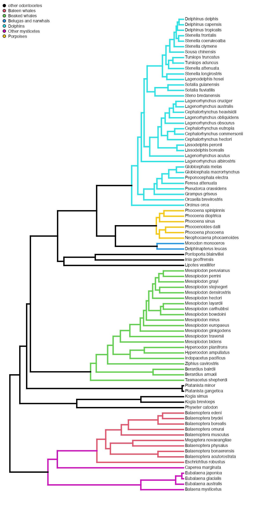
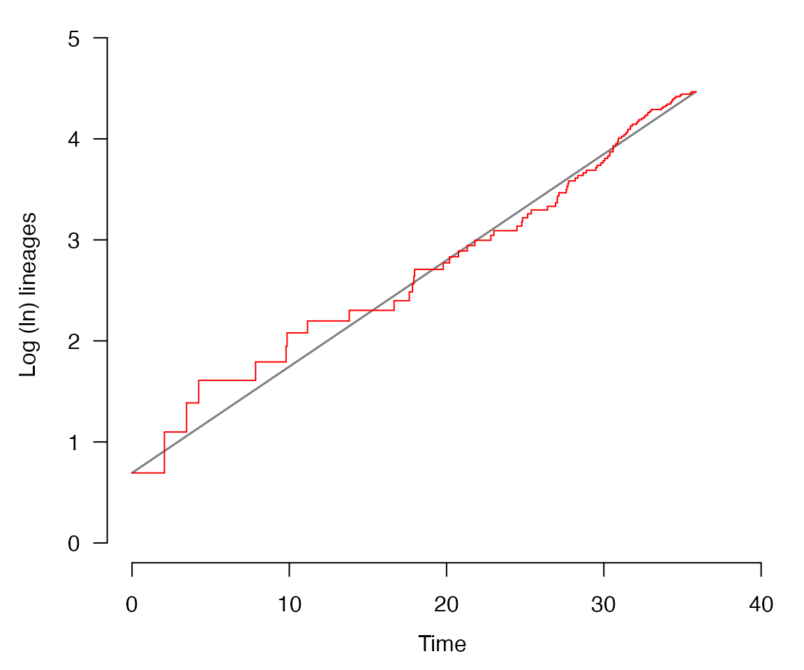
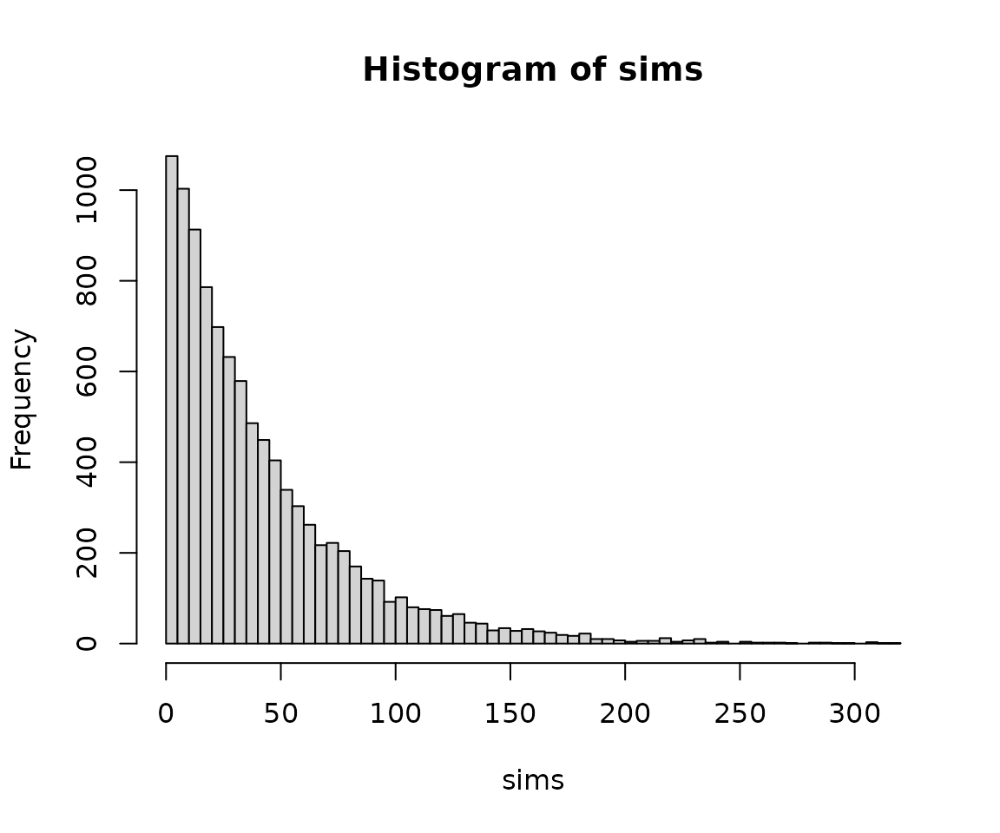

# Phylogenies and diversification

``` r
library(evolved)
library(ape)
```

## Molecular phylogenies:

Using data on molecular variation of multiple species, we can build and
date a molecular phylogeny. For instance, we can look at the whale
phylogeny:

``` r
data("whale_phylo")
```

We could check the “plain” phylogeny with the following code:

``` r
plot(whale_phylo, cex = 0.6)
axisPhylo()
```

But for this particular phylogeny, we have a build-in function that help
visualize some subclades:

``` r
plotPaintedWhales(knitr = TRUE)
```

    ## no colors provided. using the following legend:
    ##                    1        Baleen whales        Beaked whales 
    ##              "black"            "#DF536B"            "#61D04F" 
    ## Belugas and narwhals             Dolphins     Other mysticetes 
    ##            "#2297E6"            "#28E2E5"            "#CD0BBC" 
    ##            Porpoises 
    ##            "#F5C710"



Now we will visualize lineage-through-time (LTT) plots for this
phylogenetic tree. The LTT plots contain a lot of information about
phylogenetic tree structure, for instance they tell a lot about the
shape of trees produced by different speciation and extinction rates.

``` r
lttPlot(whale_phylo, knitr = T)
```



Ok, but how does this plot stores info about the phylogeny?

## Diversification

To figure this out students can use the pure-birth (=“Yule”) model,
which predicts that the same rate can generate a very large number of
species. To show this first we estimate the speciation (i.e., the birth
rate)

``` r
whalerate = estimateSpeciation(whale_phylo)
```

Because we know whale originated ~36 million years ago, we can simulate
many alternative diversification scenarios, following the parameters we
estimated:

``` r
sims=vector()

for(i in 1:10000){
  sims = c(sims, simulateBirthDeathRich(S = whalerate, E=0, t = 36))
}

hist(sims, breaks = 100)
```



Now we know that the Yule model can generate many species. Let’s check
the LTT’s that this model can generate:

``` r
t = simulateTree(c(whalerate, 0), max.taxa = 40, max.t = Inf)
ape::ltt.plot(t, col="white", ylim=c(0,87))

for(i in 1:100){
  t = simulateTree(c(whalerate, 0), max.taxa = 40, max.t = Inf)
  ape::ltt.lines(t, col="#FF000032")  
}

#Now, we add the actual whale phylogeny:
ape::ltt.lines(whale_phylo, col="black")
```


So the empirical phylogeny is very different from the simulated. What
hypotheses can students make to explain this discrepancy?

Maybe is because the Yule model is too simplistic (i.e., model has no
extinction at all)? We can test this, for instance by replacing the
[`estimateSpeciation()`](https://mjanuario.github.io/evolved/reference/estimateSpeciation.md)
function by
the[`fitCRBD()`](https://mjanuario.github.io/evolved/reference/fitCRBD.md),
and then re-do our simulations, with an extra layer of complexity.

  
  
