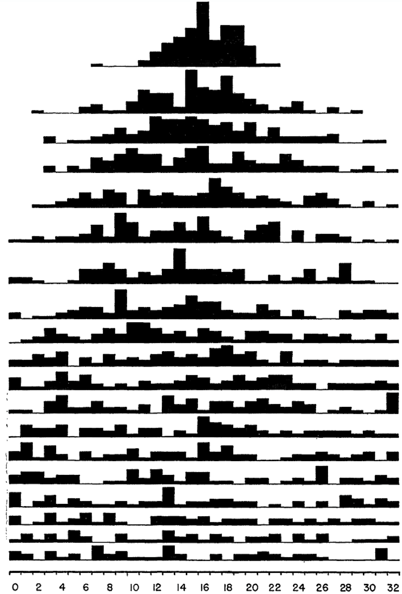

```{r setup, include=FALSE}
knitr::opts_chunk$set(echo = TRUE)
options(rmarkdown.html_vignette.check_title = FALSE)
```

# Learning objectives

1. Genetic drift: qualitative expectation
2. Genetic drift: building intuition
3. Dissecting the variability in outcomes
4. Genetic drift and heterozygosity decay
5. Effective population size
6. Historical note

***

For this tutorial, you must install the `plot3D` R package.

```
install.packages("plot3D")
```

Then, you must load it, as well as our package:

```{r}
library(evolved)
library(plot3D)

# Let's also store our par() configs so 
# we can restore them whenever we change it in this tutorial
oldpar <- par(no.readonly = TRUE)  
```

# Introduction

In previous labs, we introduced a simple way of applying probability rules to allele change through a small number of generations. In this lab, we will extrapolate qualitatively and quantitatively from those insights, and see what happens to genetic diversity over time.

# Genetic drift: qualitative expectation

As you may know, Peter Buri did an experiment on genetic drift in 1956. He started with many flask populations of _Drosophila melanogaster_ and applied a very simple method to keep track of genetic drift. In his own words (Buri, 1956):

_"The method consists in observations on the changes in gene frequency between generations in each of a large number of small cultures in which the size of the breeding population is controlled. Each initial culture founds a line in which each successive generation is initiated with a random sample of uniform size taken from among the flies of the preceding generation. The form is that of a fairly large experimental population divided into a number of very small completely isolated subunits."_

Thus, the experiment involves sampling adults at random from a flask and placing them in a new flask where they will mate. Their offspring reach adulthood and are then themselves sampled, thus producing a new generation. All the while, we keep track of relative frequencies of genotypes through time.

Now, imagine you are in Buri's lab and will run his experiment using 1000 flasks (he tracked 212 in total). When individuals from a flask become able to reproduce, you randomly and uniformly (i.e. all individuals are equally likely to be sampled) pick 8 virgin females _from the same flask and generation_ to mate only once with 8 random males from the same flask and generation. Each mating is successful and generates many viable offspring.

Assume males and females do not diverge in genotypic frequencies. Recall also that _Drosophila melanogaster_ is a diploid organism.

\fbox{\begin{minipage}{48em}
Question 1:\\

Can you compute the effective population size of each flask in Buri's experiment using just the information above? If yes, what is it?
\end{minipage}}

\fbox{\begin{minipage}{48em}
Question 2:\\

Without doing any calculations (or using R), draw on a piece of paper (or on a digital drawing app) your qualitative expectation of how the heterozygosity should change through the generations in Buri's experiment. Take a picture of your prediction and include it as your answer for this question. Don't forget to include the information about which heterozygosity you chose to draw.\\

Before doing your drawing, reflect on what happens to your prediction if the initial frequency of one of the alleles is small. What if it is high? Consider what would happen after one, some, and many generations. Don't worry about being accurate with numbers now, as we are drawing a qualitative prediction.\\
\end{minipage}}

If you are not familiar with inserting an image into an RMarkdown file:

First, make sure your image is inside the current working directory, i.e. inside the reference folder that R will use when you knit the RMarkdown file. Then, you can use the following syntax, replacing `file_name.jpg` with the specific name of your image.

```

```
***

# Genetic drift: building intuition

Now we will do a computer simulation of what Buri did. We will use the `rbinom()` function to draw allele counts from a population of a diploid organism through time. The function does this by applying the following algorithm:

1. Start with a certain probability $p$ of sampling a specific allele (e.g., $A_1$) based on that allele's frequency in the population.
2. Generate the next generation by taking random draws from a binomial distribution given probability $p$ of sampling copies of allele $A_1$.
3. Recalculate the new allele frequency. You have just observed drift!

Remember that the binomial distribution applies to binary processes and their number of "successes". Our binary process here is the sampling of alleles -- as the organisms are diploid, each of their 2 alleles will either be $A_1$ or $A_2$, with no exceptions. Our number of "successes" is the total number of $A_1$ alleles (i.e., the allele frequency, $p$) in the next flask.

So, a single flask in the first generation of our experiment can be simulated as:

```{r}
N <- 32 #population size
n_alleles <- 2*N 
p_gen0 <- 0.25 #Frequency of allele A1 in the first gen
p_gen1 <- rbinom(1, n_alleles, p_gen0) / n_alleles
p_gen1
```

Now, to do the next generation, we just have to redo this process, but this time using $p_1$, the allele frequency in generation 1, as the new probability of sampling $A_1$ alleles:

```{r}
p_gen2 <- rbinom(1, n_alleles, p_gen1) / n_alleles
p_gen2
```

What would the third generation be then?

```{r}
p_gen3 <- rbinom(1, n_alleles, p_gen2) / n_alleles
p_gen3
```

The fourth would be:

```{r}
p_gen4 <- rbinom(1, n_alleles, p_gen3) / n_alleles
p_gen4
```

The fifth would be:

```{r}
p_gen5 <- rbinom(1, n_alleles, p_gen4) / n_alleles
p_gen5
```

What is happening with the _code_ and with the _result_ at each generation?

Let's plot all results we have up to now. Note that your results will be different because you are generating different random numbers than us here.

```{r}
generations <- seq(from = 0, to = 5, by = 1)
p_through_time <- c(p_gen0, p_gen1, p_gen2, p_gen3, p_gen4, p_gen5)
plot(generations, p_through_time, type="l", lwd = 2, col = "darkorchid3",
     ylab = "p", xlab = "generations", las = 1)
```

Repeat the above lines of code a few times to get a feeling for what is happening. Do all simulations behave the same way? Can you identify different "archetypes" of dynamics?

Instead of tediously copying and pasting code in the console, we can run large numbers of simulations quite easily using the function `WFDriftSim()`:

```{r}
#We will simulate five flasks through 10 generations:
WFDriftSim(Ne = 32, n.gen = 10, p0 = 0.5, n.sim = 5)
```

Run the above chunk of code above many times to get a feeling for it. How does changing `Ne`, `n.gen`, `p0`, and `n.sim` affect your simulations?

\fbox{\begin{minipage}{48em}
Question 3:\\

Sometimes $p$ hits zero. What does that mean, biologically? What does it mean if $p=1$?
\end{minipage}}

\fbox{\begin{minipage}{48em}
Question 4:\\ 

If a population gets stuck at $p =$ 0 or 1, what can change the allele frequency? 
\end{minipage}}

\fbox{\begin{minipage}{48em}
Question 5:\\

(I) Run 5 simulations of 25 diploid individuals, with initial allele frequency p0 = 0.5. Run your simulation for more than 50 generations, and keep all parameters the same among simulations. At every simulation, write down or store the approximate number of generations until 0 or 1 was hit.\\

(II) Now, change the population size to five individuals in your flask. Run another 5 simulations and repeat the procedure in (I). Then, change population size to 125 individuals.\\

(III) What is the generalization you found? Describe it.
\end{minipage}}

\fbox{\begin{minipage}{48em}
Challenge 1:\\ 

What is the probability of waiting a given time until the fixation of an allele? Can you simulate this distribution?\\

Hint 1: Use while and for loops to simulate a flask until fixation of an allele. Then, use a for loop to simulate many flasks. Finish by making histograms (or boxplots) that show the number of generations until fixation for a thousand flasks, given specific values of n.gen, Ne, and p0.\\

Hint 2: To check if your flask hit fixation, you could use the following function provided below, 'isFixed'.

\end{minipage}}

A function to calculate if a simulation's alleles have fixed.

```{r}
# R will not return anything in the console when you run this, but 
# after running you should have this function in your R session
# as an object. Note that if you name another object as "isFixed"
# the function will be overwritten.

isFixed <- function(p, tol = 0.00000000001){
	
	if (p <= tol | p >= (1 - tol)){
		return(TRUE)
	} else{
		return(FALSE)
	}

}

# Assuming your current allele frequency is stored in the p_t object, the
# line below uses the function created above to test if p_t is equal to 
# zero OR equal to one
```

```
isFixed(p_t)
```

```{r}
# The function will return `TRUE` if p_t is equal to zero or one.
```

***

## Dissecting the variability in outcomes

If our simulations contain many independent flasks (i.e. when `n.sim` > 40), it is hard to keep track of the whole history of allele frequency change in each flask. This is when the histogram to the right of the line plot in the output of `WFDriftSim` becomes particularly helpful. Take a look at the histogram section of the output plot after typing the following into your console:

```{r}
WFDriftSim(Ne = 32, n.gen = 10, p0 = 0.5, n.sim = 100)
```


\fbox{\begin{minipage}{48em}
Question 6:\\ 

Simulate 100 flasks of genetic drift and plot them. Then, repeat the same procedure with a population size larger than 100, and then repeat the procedure again with a population size smaller than 100. Organize plots as you prefer in your answer, but include the population size for each plot.\\

How does population size affect the temporal dynamics of allele frequency?\\

Hint: Pay attention to the axes of the plot.
\end{minipage}}

\fbox{\begin{minipage}{48em}
Challenge (extra credit question) 2:\\

Look at figure 6 in Buri 1956 (below). What legend would you choose for this figure? What would the axis labels and their units be? Can you explain what is being shown in each panel?\\

Hint: Try to simulate Buri's experiment with the function 'WFDriftSim' using Buri's experimental conditions, discussed above.
\end{minipage}}

```{r, echo=F}

```

***

# Genetic drift and heterozygosity decay

In lecture, we learned an analytic formula to calculate heterozygosity decay over time due to drift.

\fbox{\begin{minipage}{48em}
Question 7:\\ 

Use this formula to make a plot showing the theoretically expected heterozygosity decay through time of a diploid, bi-allelic population with p0 = 0.5 and Ne=32. Plot from t = 0 to t = 300. This plot should contain only one line.
\end{minipage}}

\fbox{\begin{minipage}{48em}
Challenge (extra credit question) 3:\\

Now we will look at heterozygosity decay over time in simulated populations, as opposed to an analytic expectation. We will then be able to compare the "empirical" heterozygosity decay to the theoretical heterozygosity decay. Do the following:\\

(I) Simulate many populations under genetic drift (i.e. the "flasks" we simulated many times above) using p0 = 0.5 and Ne = 32. Simulate many generations.\\

(II) Calculate the expected number of heterozygotes for each flask and time.\\

(III) Then calculate the generation-specific average heterozygosity.\\

(IV) Make a plot showing, as background, the heterozygosity through time of each flask, meaning you will have as many lines as you had simulations. Then plot, in a different color, the analytic expectation using the equation we derived in class and the function lines(). Finalize your plot adding the line that shows the generation-specific average heterozygosity.\\

Tip: use the argument print.data = TRUE in the function WFDriftSim, as shown below.

\end{minipage}}

Example on how to store (and handle) your simulation results:
```{r}
data = WFDriftSim(Ne = 8, n.gen = 50, p0 = 0.5, n.sim = 50,
                  print.data = T, plot.type = "none")

#then, if we want to see the 2nd to 5th generations of 
# the simulations number 14, 17 and 18, we type:
sims <- c(14,17,18)
gens <- 3:6
subset_data <- data[sims, gens]
subset_data

#and we can also plot those results:

#first opening an empty plot:
plot(NA, ylab = "Alleleic frequency", xlab = "Generation",
     xlim = c(2, 5), ylim = c(0, 1))

#creating a set of colors to paint our lines
cols <- rainbow(n = nrow(subset_data))

#then we finally add the lines to our plot:
for (i in 1:nrow(subset_data)) {
  lines(x = gens - 1, y = subset_data[i,], col = cols[i])
}
```

Notice that the actual generation number does not match the column numbers!

***

# Effective population size

We know that in real populations, the census size might be different from the effective population size.

\fbox{\begin{minipage}{48em}
Question 8:\\

Given the time series of census size in the plot below and equation (1), calculate the effective population size of this population (assume equal numbers of males and females).
\end{minipage}}

\begin{equation}
N_e = \frac{1}{\frac{1}{t}\sum_{i=1}^t \frac{1}{N_i}}
\end{equation}

```{r, echo=FALSE}
pops <- c(rep(100000, times= 5), 50, rep(1000, times= 4))
CS <- log(pops, base=10)
time <- 1:10
plot(x=time, y=CS, xaxt="n", yaxt="n", ylim=c(1,5), ylab="Census size (individuals)", xlab="Time since study started (generations)")
lines(x=time, y=CS)

#x ticks:
xtick<-seq(1, 10, by=1)
axis(side=1, at=xtick, labels = TRUE)

#y ticks:
ytick<-c(1,log(50, 10),3,5)
axis(side=2, at=ytick, labels = c("1", "50", "1000", "100000"))
```

## Some food for thought: 

Assuming an equal number of females and males, an equal number of generations, and bottlenecks of equal magnitude (equally drastic changes in census size), which of the options below has the greatest influence on $N_e$ given equation (1)? Why?

(A) Having a large census size _prior_ to the bottleneck
(B) Experiencing a bottleneck that is very brief
(C) Having a large census size _after_ the bottleneck

A nice in-depth discussion of what the effective population size means can be found in Waples (2022).

***

# Historical note

Kimura's (1955) diffusion approximation for the distribution of allele frequencies in populations under drift is both elegant and difficult. Understanding his derivation requires some fairly sophisticated mathematics. However, there is a much easier way to generate and visualize the expectation for the distribution of allele frequencies across populations under drift, if we assume the population size is reasonably small. The solution described below involves a Markov chain model of drift. 

Fundamentally, the probability model we will use is a binomial sampling model. This is nothing more than the "coin-toss" distribution: what is the probability of getting (say) $k$ heads out of $n$ coin tosses, given that the probability of heads on any given toss is $p$? More formally we denote this probability by $P(k|n; p)$.

Under a binomial sampling model, we can estimate the probability $P(k|n; p)$ using the binomial probability, or:

\begin{equation}
P(k | n; p) = \binom{n}{k} p^k (1-p)^{n-k}
\end{equation}

Let's say we have a population with alleles $A$ and $a$, with respective frequencies $p$ and $1 - p$. The relationship between the binomial model and genetic drift is that, for a finite population, we can use this to compute the exact probability that we will sample $k$ alleles of a given type in a given generation, given an initial frequency $p$. So, for example, consider Buri's genetic drift data, where $2N = 32$, and where the initial allele frequencies were equal ($p = 0.5$). Given this starting configuration at time $t_0$ (e.g., $n = 32$, $p = 0.5$), we can use the binomial probability to compute the exact probability of sampling $k$ alleles in generation $t_1$. 

I'm going to switch notation here. For shorthand, I'm going to use the expression $P_{i, k}$ to denote the probability that a population with $k$ type $A$ alleles has $i$ copies after one generation of drift (sampling). This necessarily depends on a particular population size. For example, $P_{13, 16}$ is the probability that a given generation of random mating in a Wright-Fisher population gives 13 $A$ alleles given that the population currently has 16 such alleles, but obviously, this probability is critically dependent on the population size. For the Buri data, with $2N = 32$, the probability $P_{13 , 16}$ corresponds to binomial parameters $p = 0.5$ and $n = 32$. But this probability would obviously differ for any other $n$. 

Now, imagine forming a matrix of $2N + 1$ columns and $2N + 1$ rows. Here, each element $(i, k)$ gives the probability -- the _transition probability_ -- associated with sampling $i$ alleles of type $A$ in generation $t+1$ given that you are currently at $k$ $A$ alleles in generation $t$. The matrix has $2N + 1$ rows and columns because we also have an extra row and column to account for the state of $0$ alleles.

\[\begin{bmatrix}
P_{0,0} & P_{0,1} & P_{0,2}  & \cdots & P_{0, n}\\
P_{1,0} & P_{1,1} & P_{1,2}  & \cdots & P_{1, n}\\
P_{2,0} & P_{2,1} & P_{2,2}  & \cdots & P_{2, n}\\
P_{3,0} & P_{3,1} & P_{3,2}  & \cdots & P_{3, n}\\
\vdots & \vdots   & \vdots   & \ddots & \vdots \\ 
P_{n,0} & P_{n,1} & P_{n,2}  & \cdots & P_{n, n}\\
\end{bmatrix}\] 

Of course, the probability of going from $0$ $A$ alleles to any number of alleles greater than $0$ is also $0$ (because 0 is an absorbing state -- after the allele is lost in the population, it cannot increase in frequency). So the first column is necessarily zero, with the exception of $P_{0,0}$, which is $1$ (if you have $0$ $A$ alleles at time $t$, you will have $0$ $A$ alleles at time $t + 1$ with probability $1$). The same general idea holds for the last column: if you are at the maximum number of $A$ alleles, e.g., $n$ $A$ alleles, then you can't sample $2$ in the following generation. In our example, with $2N = 32$, both $0$ and $32$ are absorbing states. So the matrix is:

\[\begin{bmatrix}
1 & P_{0,1} & P_{0,2}  & \cdots & 0\\
0 & P_{1,1} & P_{1,2}  & \cdots & 0\\
0 & P_{2,1} & P_{2,2}  & \cdots & 0\\
0 & P_{3,1} & P_{3,2}  & \cdots & 0\\
\vdots & \vdots   & \vdots   & \ddots & \vdots \\ 
0 & P_{n,1} & P_{n,2}  & \cdots & 1\\
\end{bmatrix}\] 

Let's call this matrix $P$. It is a transition matrix, and it has some really nice properties. This matrix includes the probabilities for all possible pairwise transitions between states. As such, the columns of the matrix must sum to $1$. Once we've defined this matrix, we can fill in all of the individual elements with binomial probabilities. So, for example, assuming $2N = 32$, we can fill in $P_{3, 5}$ by first noting that the frequency of $A$ at time $t$ is $p = \frac{5}{32}$. 

\begin{equation}
P_{3,5} = \binom{32}{3} \binom{5}{32}^3 (1-\frac{5}{32})^{32-3}
\end{equation}

The amazing thing about the transition matrix $P$ is that we can use it to compute the distribution of alleles after a generation of random mating, given some initial vector of allele counts $N_0$. Here, $N_0$ is a vector with the property that each element $i$ of the vector gives the number of populations having $i$ alleles. For example, $N_0[0]$ gives the number of initial populations with $0$ $A$ alleles. In the Buri data, with roughly 100 populations with equal allele frequencies, we would have $N_0[16] = 100$ (100 populations, each with 16 $A$ alleles at time $t = 0$) and all other elements of the vector equal to zero. 

We can now construct a Markov chain, to compute the probability distribution of populations with a given allele count, as

\begin{equation}
N_1 = PN_0
\end{equation}

where $P N_0$ involves matrix multiplication of the column vector $N_0$ by the square matrix $P$. $N_1$ is the mean number of populations in each allele count category. For example, $N_1[7]$ is the number of populations in generation $t = 1$ that have $7$ alleles (remember: the starting state was given by the vector $N_0$). More generally, we have:

\begin{equation}
N_{t+1} = PN_t
\end{equation}

And we can see where this is going. It's a recursive relationship whereby:

\begin{equation}
N_{t+2} = P (P N_0)
\end{equation}

and

\begin{equation}
N_{t+3} = P ( P (P N_0))
\end{equation}

Etc etc. Thus, computing the distribution of allele frequencies can easily be done by iterating the equation given above, provided we have $P$ and $N_0$. 

The R code below implements this model and uses it to compute the distribution of populations for each possible number of alleles, using Buri's _Drosophila_ study as a guide.

```{r, fig.width=10}
# A simple genetic drift simulator as a Markov process
N       <- 16
popsize <- 2*N

# Now we define a transition matrix, such that:
# Each element of the transition matrix is a transition probability
#   Specifically: element Pi,j is the probability of going from
#   j alleles to i alleles in a single sampling step 
#  

tmat <- matrix(0, nrow = popsize + 1, ncol = popsize + 1) # along rows: current allele count; along cols: future allele count

# Fill in elements with probabilities from the binomial distribution
# If you have j alleles in generation t-1, then this defines the probability
# of sampling (0,1....2N) alleles in the next generation, under a binomial 
# sampling process:

# Note also that first column and row are absorbing states of 0

# Here is the vector of frequencies:
probvec <- (1:popsize) / popsize  

# What is the probability of getting to 0 allele copies, given 
# that you have 1? This is P01, and the transition probability 
# would be computed using 1/2N (=1/32) as the sampling probability 
# for the allele. 
# Here, this is computed using the function dbinom, which is a shortcut 
#   to the analytical binomial probability:
dbinom(1, popsize, prob = 1/32)

# Now we will set up the full matrix by iterating this over rows:

for (ii in 1:nrow(tmat)){
	tmat[ii, 2:ncol(tmat)] <- dbinom(ii - 1, size = popsize, prob = probvec)
}

# Note: we ignore the first column and let almost all elements equal zero, 
# because the probability of sampling k alleles given that you currently have zero
# is zero everywhere except the special case of P00, which is 1 
# (if you have zero now, you will have zero in the next gen with probability 1)
# To address this, we manually set element P00 equal to 1:
tmat[1,1] <- 1

#Now, all the columns should sum to 1:
colSums(tmat)

# Pt <- tmat^2*P0 

# Initial vector of population frequencies:
# Like Buri, suppose we do an experiment with 100 populations
# each with equal allele frequencies (p = q = 0.5) initially.
p_init <- rep(0, popsize + 1)

# note, in this indexing:
#   p_init[1] is the number of populations with 0 alleles
#   p_init[2] is the number with 1 allele
#   p_init[popsize + 1] is the number with 2N alleles

# we want the initial population to have 2N/2 = N p alleles (for 50:50 proportion of alleles)
#  so we fill in the N+1 element of p_init vector with the 
#  number of populations

p_init[N+1] <- 100
```

``` {r, echo = T, eval = F}
#Now, we will introduce drift in our simulation
# after 1 generation of random mating in Wright-Fisher (WF) population, 
#  the distribution of populations is:
tmat %*% p_init
 
# and after 2 generations, it is:
tmat %*% (tmat %*% p_init)

# and after 3 generations, it is:
tmat %*% (tmat %*% (tmat %*% p_init))
```

``` {r}
# This is easy enough to iterate.
# Here, we will make a matrix to hold 
# the results, for up to ngen generations

ngen    <- 20
freqmat <- matrix(NA, nrow=popsize+1, ncol=ngen)

curr_pop <- p_init 

for (ii in 1:ngen){
	
	# recompute the new pop frequency distribution
	curr_pop <- tmat %*% curr_pop
	# store it:
	freqmat[,ii] <- curr_pop
}


plot3D::persp3D(x = c(0, probvec), z=freqmat, theta=45, phi=20, contour =F,
                xlab="Allele frequency", zlab="Number of populations",
                ylab="Generations")
 

# Plotting selected generations:
########## 
plot.new()
par(oma=c(1,1,1,1), mfrow=c(2,2), mar=c(2,2,2,0))

pfx <- function(gen){
	plot.new()
	plot.window(xlim=c(0,33), ylim=c(0, 15))
	axis(1, at=seq(-4, 36, by=4))
	axis(2, at=seq(-2, 16, by=2), las=1)
	lines(x=c(16,16), y=c(0, 18), lwd=5, col="gray60")
	title(main = paste("After", gen, ifelse(gen == 1, "gen", "gens")))
}

# Expectation after 1 generation of drift:
pfx(1)
points(x=0:32, y=freqmat[,1], pch=21, bg="red", cex=1.5)

# Expectation after 5 generations of drift
pfx(5)
points(x=0:32, y=freqmat[,5], pch=21, bg="red", cex=1.5)

# Expectation after 10 generations of drift
pfx(10)
points(x=0:32, y=freqmat[,10], pch=21, bg="red", cex=1.5)

# Expectation after 15 generations of drift
pfx(15)
points(x=0:32, y=freqmat[,15], pch=21, bg="red", cex=1.5)

# Restoring old par() configs:
par(oldpar)
```

The above visually resembles figure 6 in Buri (1956) -- but please remember this is an _analytical expectation_.

\fbox{\begin{minipage}{48em}
Challenge (extra credit question) 4: \\

What is the 3D plot showing? Why does this 3D plot look like this shape with one mode at one side and 2 modes at the other side? Why are the two peaks smaller than the single mode at the other side of the plot?
\end{minipage}}

A little more on the history of this mathematical model can be found in the initial parts of Tran _et al_ (2013) -- but note that the mathematics that is developed in the later parts of the paper may be challenging. The original references on the Wright-Fisher population model are Fisher (1922) and Wright (1931).

***

## References:

Buri, P. (1956). Gene frequency in small populations of mutant Drosophila. Evolution, 367-402.

Fisher RA (1922) On the dominance ratio. Proc. R. Soc. Edinb 42:321–341

Kimura, M. (1955). Solution of a process of random genetic drift with a continuous model. Proceedings of the National Academy of Sciences of the United States of America, 41(3), 144.

Tran, T. D., Hofrichter, J., & Jost, J. (2013). An introduction to the mathematical structure of the Wright–Fisher model of population genetics. Theory in Biosciences, 132(2), 73-82. **[good for the historical review, math can be challenging]**

Waples, R. S. (2022). What is Ne, anyway?. Journal of Heredity, 113(4), 371–379.

Wright S (1931) Evolution in Mendelian populations. Genetics 16:97–159